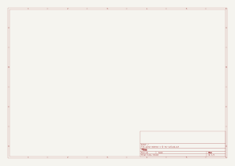

# parla-estereo

[volver al índice](./README.md)

## Especificaciones

- formato: standalone
- interfaz: 2x potes
- entradas: 1x TRS 1/8"
- salidas: 2x parlantes

## Revisión activa

`v-0-rev-a`

## Esquemático y placa

Generados automáticamente por GitHub Actions a partir de `parla-estereo/parla-estereo-v-0-rev-a/parla-estereo-v-0-rev-a.kicad_sch` y `.kicad_pcb` en cada push que los modifica.

## Bill of materials

Generado a partir de `parla-estereo/parla-estereo-v-0-rev-a/parla-estereo-v-0-rev-a.kicad_sch`.

<!-- BOM_TABLE_START -->
*(el esquemático todavía no tiene componentes)*
<!-- BOM_TABLE_END -->
