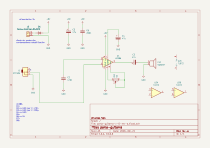
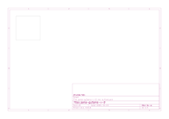

# parla-guitarra

[volver al índice](./README.md)

## Especificaciones

- formato: standalone
- interfaz: 1x pote
- entradas: 1x TS 1/4"
- salidas: 1x parlante

## Revisión activa

`v-0-rev-a`

## Esquemático y placa

Generados automáticamente por GitHub Actions a partir de `parla-guitarra/parla-guitarra-v-0-rev-a/parla-guitarra-v-0-rev-a.kicad_sch` y `.kicad_pcb` en cada push que los modifica.

## Bill of materials

Generado a partir de `parla-guitarra/parla-guitarra-v-0-rev-a/parla-guitarra-v-0-rev-a.kicad_sch`.

<!-- BOM_TABLE_START -->
| Referencias | Cantidad | Valor | Huella | Descripción |
| --- | --- | --- | --- | --- |
| C2 | 1 | 470n | *(sin huella asignada)* | Capacitor cerámico |
| C3, C4, C5 | 3 | 47u | *(sin huella asignada)* | Capacitor electrolítico |
| C6 | 1 | 200n | *(sin huella asignada)* | Capacitor cerámico |
| J1 | 1 | AudioJack2_SwitchT | *(sin huella asignada)* | Jack de audio mono |
| J2 | 1 | Screw_Terminal_01x02 | *(sin huella asignada)* | Bornera de 2 pines |
| LS1 | 1 | Speaker | *(sin huella asignada)* | Parlante |
| RV1 | 1 | 5k | *(sin huella asignada)* | Potenciómetro |
| U1 | 1 | LM386 | *(sin huella asignada)* | Amplificador de audio LM386 |

10 componentes en total. Los ítems marcados *(sin huella asignada)* todavía no están completos en el esquemático — hay que completarlos antes de generar gerbers o comprar partes para esta revisión.
<!-- BOM_TABLE_END -->
