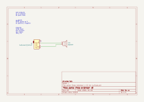

# parla-linea-extensor

[volver al índice](./README.md)

## Especificaciones

- formato: standalone
- interfaz: —
- entradas: 1x TRS 1/8"
- salidas: 1x parlante

## Revisión activa

`v-0-rev-a`

## Esquemático y placa

Generados automáticamente por GitHub Actions a partir de `parla-linea-extensor/parla-linea-extensor-v-0-rev-a/parla-linea-extensor-v-0-rev-a.kicad_sch` y `.kicad_pcb` en cada push que los modifica.

## Bill of materials

Generado a partir de `parla-linea-extensor/parla-linea-extensor-v-0-rev-a/parla-linea-extensor-v-0-rev-a.kicad_sch`.

<!-- BOM_TABLE_START -->
| Referencias | Cantidad | Valor | Huella | Descripción |
| --- | --- | --- | --- | --- |
| J1 | 1 | AudioJack3_SwitchT | *(sin huella asignada)* | Jack de audio estéreo |
| LS1 | 1 | Speaker | TerminalBlock:TerminalBlock_MaiXu_MX126-5.0-02P_1x02_P5.00mm | Parlante |

2 componentes en total. Los ítems marcados *(sin huella asignada)* todavía no están completos en el esquemático — hay que completarlos antes de generar gerbers o comprar partes para esta revisión.
<!-- BOM_TABLE_END -->
