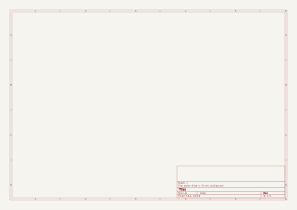
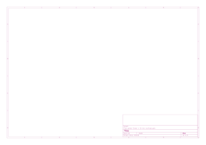

# parla-linea

[volver al índice](./README.md)

## Especificaciones

- formato: standalone
- interfaz: 2x potes
- entradas: 1x TRS 1/8"
- salidas: 1x parlante, 1x TRS 1/8"

## Revisión activa

`v-0-rev-a`

## Esquemático y placa

Generados automáticamente por GitHub Actions a partir de `parla-linea/parla-linea-v-0-rev-a/parla-linea-v-0-rev-a.kicad_sch` y `.kicad_pcb` en cada push que los modifica.

## Bill of materials

Generado a partir de `parla-linea/parla-linea-v-0-rev-a/parla-linea-v-0-rev-a.kicad_sch`.

<!-- BOM_TABLE_START -->
| Referencias | Cantidad | Valor | Huella | Descripción |
| --- | --- | --- | --- | --- |
| C1 | 1 | C_Polarized | *(sin huella asignada)* | Capacitor electrolítico |
| C2, C5 | 2 | 100n | *(sin huella asignada)* | Capacitor cerámico |
| C3 | 1 | 100u | *(sin huella asignada)* | Capacitor electrolítico |
| C4 | 1 | 10u | *(sin huella asignada)* | Capacitor electrolítico |
| D1 | 1 | 1N4007 | *(sin huella asignada)* | Device:D |
| D2 | 1 | LED | *(sin huella asignada)* | Device:LED |
| J1 | 1 | AudioJack3_SwitchT | *(sin huella asignada)* | Jack de audio estéreo |
| J2 | 1 | AudioJack2_SwitchT | *(sin huella asignada)* | Jack de audio mono |
| J3 | 1 | Screw_Terminal_01x02 | *(sin huella asignada)* | Bornera de 2 pines |
| R1, R2 | 2 | 10k | *(sin huella asignada)* | Resistencia |
| R3 | 1 | 1k | *(sin huella asignada)* | Resistencia |
| RV1 | 1 | A10k | *(sin huella asignada)* | Potenciómetro |
| U1 | 1 | PAM8403D | Package_SO:SOIC-16_3.9x9.9mm_P1.27mm | Amplificador de audio clase D |
| U2 | 1 | L7805 | *(sin huella asignada)* | Regulador de voltaje lineal +5V |

16 componentes en total. Los ítems marcados *(sin huella asignada)* todavía no están completos en el esquemático — hay que completarlos antes de generar gerbers o comprar partes para esta revisión.
<!-- BOM_TABLE_END -->
